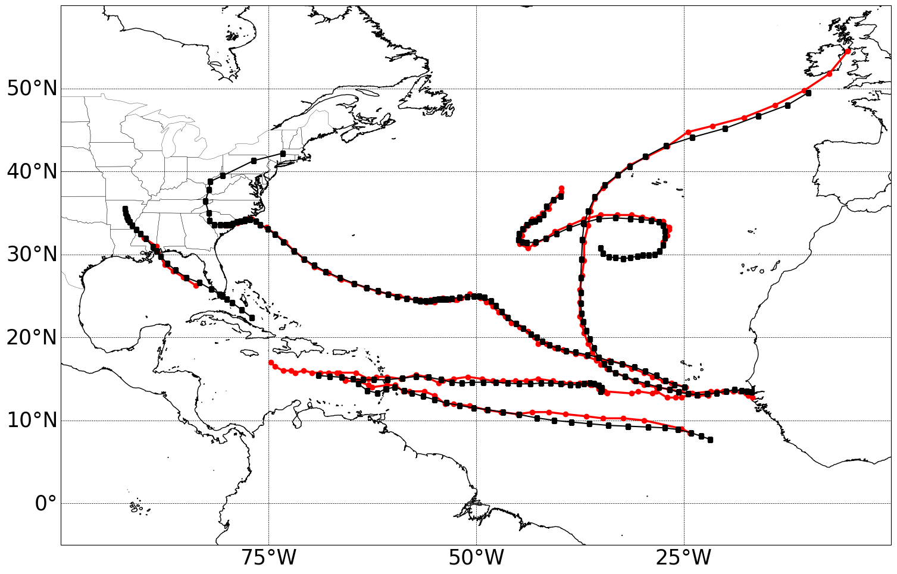

Example Case
============

The steps to run the testing case are described below.

Steps
-----

1 - After install CyTRACK, you can manually run the testing example on your local PC by clonning the CyTRACK repository.

.. code:: bash

    git clone https://github.com/apalarcon/CyTRACK.git

2 - Go to CyTRACK/testing_CyTRACK directory

.. code:: bash

    cd  CyTRACK/testing_CyTRACK

3 - Create the directory data/ERA5_data

.. code:: bash

    mkdir data/ERA5_data

4 - The input data is from the ERA5 reanalysis. You can download it from Zenodo (https://doi.org/10.5281/zenodo.10767422) and copy it into `data/ERA5_data` directory. 
Alternatively, CyTRACK will automatically download the required ERA5 input data. Therefore, be sure you have installed and correctly configured the python CDS API (cdsapi) for data downloading (see How to use the CDS API - Climate Data Store - Copernicus).

5 - Run the example case

.. code:: bash

    mpirun -n 16 python run_CyTRACK.py -pf test_CyTRACK.cfg

Testing input file
------------------

The `test_CyTRACK.cfg` input file is presented below. You can use it to run the example case.

.. code:: bash

    #============================================================================================================
    #||                               +++++++           +++++++  +++++     +     +++++++                       ||
    #||                               +        +     +     +     +   +    + +    +                             ||
    #||                               +         +   +      +     +++++   +++++   +                             ||
    #||                               +           +        +     + +    +     +  +                             ||
    #||                               +++++++     +        +     +  +   +     +  +++++++                       ||
    #||                           <------------------------------------------------------->                    ||
    #||                                         Cyclone Tracking Version 1.0.1                                 ||
    #||                                               Copyright 2022                                           ||
    #||                                                                                                        ||
    #||                                                                                                        ||
    #||                CyTRACK Version 1.0.1 is free under the terms of the GNU General Public license         ||
    #||                                  EphysLab (Environmental Physics Laboratory)                           ||
    #||                                              Universidade de Vigo                                      ||
    #||                                     contact: albenis.perez.alarcon@uvigo.es                            ||
    #||                                                                                                        ||
    #============================================================================================================
    #CyTRACK INPUT PARAMETERS.
    #For details use python python run_CyTrack -cyh t
    #For run CyTrack use python run_CyTrack.py -pf cytrack_inputs 
    #You can use your own input file following the instructions below 
    #------------------------------------------------------------------------------------------------------------
    #Print info during CyTrack runs ["True" / "False"]. Default value ['True']
    verbose="True"

    #Cyclone Type ["TC"/"EC"/"MC"].
    cyclone_type="TC"

    #============================================================================================================
    #CyTRACK Source information
    #============================================================================================================

    #Source of data ['WRF' / 'ERA5']
    source="ERA5"

    #source of data for tracking cyclones
    path_data_source="data/ERA5_data/"

    #Only for ERA5. The name of era5 files must be like this era_file_prefix_yyyymmdd_hh.nc or era_file_prefix_yyyymmddhh.nc. CyTRACK download ERA5 files if not found it
    #Prefix in the name of era file.
    era_file_prefix="uvmslp_ERA5"

    #Format of the date in ERA5 file ['yyyymmdd_hh' / 'yyyymmddhh']
    era_date_file_name='yyyymmdd_hh'

    #Checking for upper level parameters ['yes' / 'no']. These parameters are for TC and MC
    checking_upper_levels_parameters="yes"

    #Get VTL and VTU from linear regression. ["yes" / 'no']. Only if checking_upper_levels_parameters='yes'
    vtl_vtu_lr='yes'

    #Distance form storm center to compute cyclone phase space parameters. Only if Checking for upper level parameters = 'yes' 
    max_dist=500

    #path to upper level files. Only if source = ERA5
    path_data_source_upper="data/ERA5_data"

    #Prefix for upper levels files. Only if source = ERA5. 
    #The name of era5 upper files must be like this era_upperfile_prefix_yyyymmdd_hh.nc or era_upperfile_prefix_yyyymmddhh.nc 
    #The date format will be the same as era_date_file_name
    #CyTRACK will automatically download ERA5 upper files if they are not found
    era_upperfile_prefix="upper_ERA5"

    #approximate data resolution in km
    model_res=28

    #Search regions ['NA',"SA",'NP',"SP","SI","SA",'NH','SH','GL'] for ECs, ['AL','EP','WP','NI','SI','SP','SA','NH','SH','GL'] for TCs. GL: global scale
    #NH: North Hemisphere, SH: South Hemisphere
    search_region="AL"

    #Search limits in the region [lonmin,latmin,lonmax,latmax] 
    search_limits=[-110,0,5,55]

    #============================================================================================================
    #CyTRACK date configuration
    #============================================================================================================

    #Start date parameters  [yyyy mm dd hh]
    begin_year="2018" 
    begin_month="09"
    begin_day="01"
    begin_hour="00"

    #End date parameters [yyyy mm dd hh]
    end_year="2018"
    end_month="09"
    end_day="30"
    end_hour="18"

    #input file time_step, integer desde 1 hasta 6
    dt_h=6

    #============================================================================================================
    #CyTRACK Output file information
    #============================================================================================================

    #path to save CyTRACK outputs
    path_out="./"

    #path to save temporal files nedeed for CyTRACK runs
    tmp_dir="./"

    #Remove tmp_dir  ['yes' / 'no']. Default remove_tmp_dir='yes'
    remove_tmp_dir="yes"

    #============================================================================================================
    #CyTRACK DEFAUL VALUES FOR TROPICAL CYCLONES (TCs)
    #============================================================================================================

    #Minimum time (time steps) in which the detected cyclone satisfies the thermal structure determined by the cyclone phase space. Only necessary if checking_upper_levels_parameters="yes".
    #Default value=3. Set core_criteria_length=-99 to match the full trajectory.
    core_criteria_length=3

    #Lower thermal wind threshold (VTL). Only necessary if checking_upper_levels_parameters="yes".
    #VTL>VTL_threshold. Default VTL_threshold=0
    VTL_threshold=0

    #Upper thermal wind threshold (VTU). Only necessary if checking_upper_levels_parameters="yes".
    #VTU<VTU_threshold. Default VTU_threshold=0
    VTU_threshold=0

    #B parameter. Only necessary if checking_upper_levels_parameters="yes".
    #|B|<Bhart_threshold. Default Bhart_threshold=10
    Bhart_threshold=10

    #Minimum wind speed in m/s threshold to consider a low pressure grid point as TC centre
    max_wind_speed_threshold=8

    #Outer ninimum wind speed in m/s threshold to consider compute the TC outer radius
    outer_wind_speed_threshold=6

    # Minimum distance between two critical centers in km. Default filter_center_threshold=400
    filter_center_threshold=400

    #Maximum distance between centres (in km) in continuos time steps. Default dist_threshold=650
    dist_threshold=650

    # Critical outer radius in km to considerer a low pressure point as critical center. Default critical_outer_radius=100
    critical_outer_radius=100

    #resolution for radial legs in km. Default dr_res=100
    dr_res=100

    #resolution of angle steps for radial legs in degrees. Default d_ang=10
    d_ang=10

    #external search radius in km. Default rout=1000 km
    rout=1000

    #Terrain filter in m. Set terrain_filter=0 to not apply terrain filter. Default terrain_filter=0
    terrain_filter=0

    #TC maximum intensity threshold in m/s along the full trajectory. intensity_threshold=10
    intensity_threshold=10

    #Threshold for EC lifetime in hours. Default dt_lifetime=48
    dt_lifetime=36

    #TRelative vorticity threshold in 1/s to filter critical TCs centres. vorticity_threshold=1.45e-5
    vorticity_threshold=1.45e-5

    #Maximum slp treshold in hPa to filter TC centres. Deafult min_slp_threshold=1015
    min_slp_threshold=1015

    #Radial distance (in degrees) for  cheking the MSLP increase, default great_circle_distance=5.5
    great_circle_distance=5.5

    #Change in MSLP (in Pa) over a distance of great-circle-distance from the candidate point, default dmslp_great_circle_distance=200
    dmslp_great_circle_distance=200

    #Radius (in km) for computing the maximum surface winds, default radius_for_msw=100
    radius_for_msw=100

    #Dates before the specific date and hour to compute the average mslp. Default prev_days=14
    prev_days=14

    #Mean sea level pressure anomaly threshold in hPa to consideded a grid point as candidate for system centre. Default mslp_anomaly_threshold=-2
    mslp_anomaly_threshold=-2.

Results
----------------

.. note::

     The example is for tracking tropical cyclones in September 2018 in the North Atlantic basin. It is also important to remark that some tropical cyclones in the eastern Pacific Ocean can be captured by CyTRACK.

If CyTRACK runs successfully, the CyTRACK_output directory should be created. In this directory, you should find the following file `CyTRACK_output/CyTRACK_AL_2018090100-2018093018_ERA5_TC.dat`, containing the information on the identified tropical cyclones.

2 - To plot the cyclones tracks, run the `plotting_test_CyTRACK_outputs.py` script. As the North Atlantic is the target basin, this script removed for plotting cyclones that formed over the eastern Pacific Ocean.

The `plotting_test_CyTRACK_outputs.py` is presented below.

.. code:: python

    import numpy as np
    import matplotlib.pylab as plt
    import sys
    import os
    from shapely.geometry import Polygon, MultiPolygon, Point 
    import requests

    def create_map(search_limits=[None, None, None, None]):
        from cartopy import config
        from cartopy.util import add_cyclic_point
        import cartopy.feature as cfeature
        import cartopy.crs as ccrs
        from cartopy.mpl.geoaxes import GeoAxes
        from cartopy.mpl.gridliner import LONGITUDE_FORMATTER, LATITUDE_FORMATTER
        import matplotlib.ticker as mticker	
        import math	
        
        min_lon,min_lat=(search_limits[0],search_limits[1])
        max_lon,max_lat=(search_limits[2],search_limits[3])
        paso_h=25
        

        
        crs = ccrs.PlateCarree()
        mapa=plt.subplot(1,1,1,projection=ccrs.PlateCarree(0) )
        mapa.add_feature(cfeature.COASTLINE.with_scale('10m'), linewidth=1)
        mapa.add_feature(cfeature.STATES, linewidth=0.25)
        mapa.set_extent([min_lon,max_lon,min_lat,max_lat], crs=ccrs.PlateCarree())
        
        
        gl = mapa.gridlines(crs=ccrs.PlateCarree(), draw_labels=True,linewidth=0.5, color='black', alpha=1, linestyle='--')
        lons=np.arange(math.ceil(min_lon),math.ceil(max_lon),paso_h)
        
        gl_lon_info=[]
        for clons in lons:
            if clons<180:
                gl_lon_info=np.append(gl_lon_info,clons)
            else:
                gl_lon_info=np.append(gl_lon_info,clons-360)

        gl_loc=[True,False,False,True]
        gl.ylabels_left = gl_loc[0]
        gl.ylabels_right = gl_loc[1]
        gl.xlabels_top = gl_loc[2]
        gl.xlabels_bottom = gl_loc[3]

        lons=np.arange(math.floor(min_lon-paso_h),math.ceil(max_lon+paso_h),paso_h)
        gl.xlocator = mticker.FixedLocator(lons)
        gl.xformatter = LONGITUDE_FORMATTER
        gl.yformatter = LATITUDE_FORMATTER
        gl.xlabel_style = {'size': 30, 'color': 'black'}
        gl.ylabel_style = {'size': 30,'color': 'black'}

        return mapa

    def get_basin_limits():
        NATL = Polygon(((260, 40), (345, 40), (345, 0), (295, 0), (260, 20)))
        return NATL

    def index_row(myList, v):
        j=[]
        for i, x in enumerate(myList):
        
            if v in x:
                j.append(i)
        return j

    plt.figure(figsize=(18,12))
    mapa=create_map(search_limits=[-100, -5, 0, 60])

    basin_limits=get_basin_limits()

    cfile=open("CyTRACK_output/CyTRACK_AL_2018090100-2018093018_ERA5_TC.dat")
    cfile=cfile.readlines()

    lenght=len(cfile)

    index=0
    cont=0
    while index<lenght:
        line_data=cfile[index].split(",")
        
        diff=int(line_data[1].split("\n")[0])
        lats=[]
        lons=[]
        
        for i in range(index+1,index+diff+1):
            line_data=cfile[i]
            n_data=line_data.split(",")
            
            lats=np.append(lats,float(n_data[2]))
            lons=np.append(lons,float(n_data[3]))
            
        
        latg=lats[0]
        long=lons[0]
        if long<0:
            long=long+360

        point=Point(long, latg)
        if point.within(basin_limits):
            mapa.plot(lons,lats, color="r", linewidth=2.5, marker='o')
            cont=cont+1
            
            
        index=index+diff+1

    r = requests.get("https://www.nhc.noaa.gov/data/hurdat/hurdat2-atl-02052024.txt", allow_redirects=True)
    open('hurdat2-atl-02052024.txt', 'wb').write(r.content)

    hdata=open("hurdat2-atl-02052024.txt")
    hdata=hdata.readlines()

    indexa=index_row(hdata,"AL062018")
    indexa=indexa[0]

    indexb=index_row(hdata,"AL132018")
    indexb=indexb[0]

    index=indexa
    while index <indexb:
        line_data=hdata[index]
        
        data=line_data.split(",")

        diff=int(data[2])

        lats=[]
        lons=[]
        for j in range(index+1, index+diff+1):
            line_data=hdata[j]
            n_data=line_data.split(",")
            lat=float(n_data[4][0:5])
            lon=float(n_data[5][0:6])
            ch_lon=n_data[5][6:7]

            if ch_lon=="W":
                lon=lon*(-1)

            date=n_data[0]
            if date[4:6]=="09":
                lats=np.append(lats, lat)
                lons=np.append(lons, lon)

        if len(lats)>7:
            mapa.plot(lons,lats, color="k", linewidth=1.5, marker='s')

        index=index+diff+1
    plt.savefig("CyTRACK_testing_tracks.png",bbox_inches="tight")

.. code:: python

    python plotting_test_CyTRACK_outputs.py

Resulting plot

