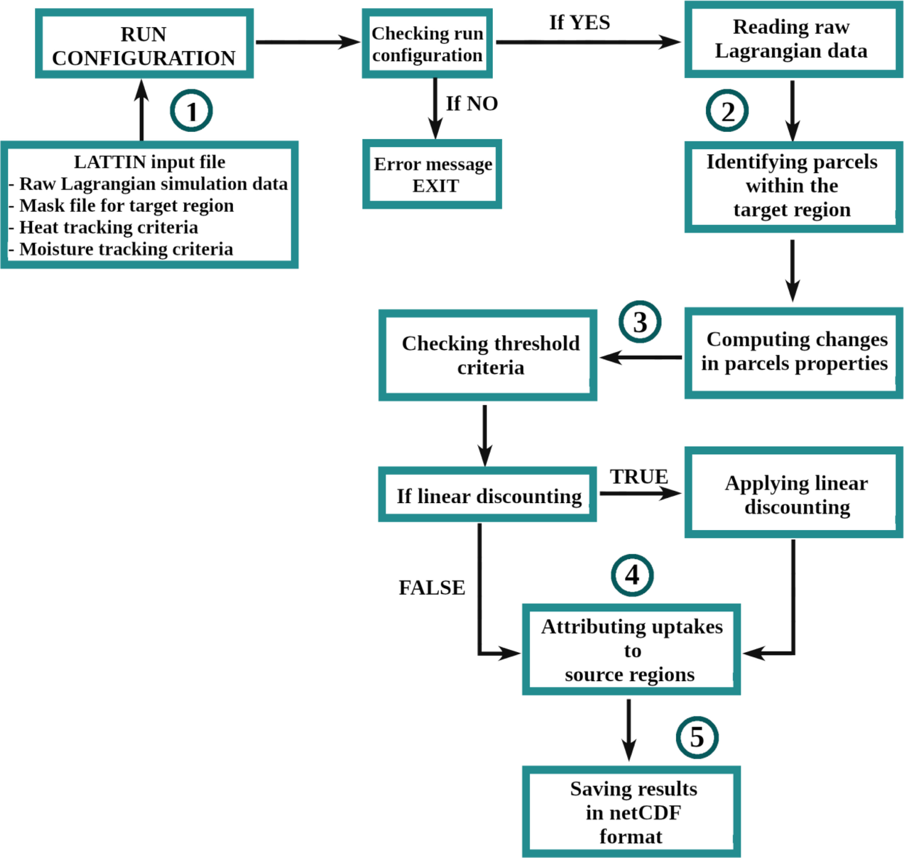

LATTIN: Lagrangian Atmospheric moisTure and heaT trackINg
=================================
The Lagrangian Atmospheric moisTure and heaT trackINg (LATTINv1.0.4) is a software developed in Python and Fortran
for the study of moisture and heat sources. It has been developed within the 
SETESTRELO project at the EPhysLab (Environmental Physics Laboratory) at the University of Vigo. 

LATTIN is a Python-based tool for Lagrangian atmospheric moisture and heat tracking

Moisture tracking methods
-------------------------

The following Table displays an overview of threshold parameters for identifying moisture sources for precipitation events. The * symbol indicates mean value of the variable. These threshold
values have been obtained for Δt = 6 h.

+------------+-----------------------+-------------------------------------------------+------------------------------------+----------------------------+
|            | Precipitating parcels |     **Moisture uptake**                         |      **Moisture losses**           |                            |
| **Method** | at target region      +-----------------+-------------------+-----------+-------------------+----------------+      **Reference**         |
|            |                       | **Δq (g/kg)**   | **|ΔRH| (%)**     | ABL       | **Δq (g/kg)**     | **RH (%)**     |                            |  
+------------+-----------------------+-----------------+-------------------+-----------+-------------------+----------------+----------------------------+
|  SJ05      |         -             |      -          |        -          |  no       |       -           |     -          |  Stohl and James (2005)    |
+------------+-----------------------+-----------------+-------------------+-----------+-------------------+----------------+----------------------------+
| SOD08      |  Δq < -0.2  &         | Δq > 0.2        |        -          | z*<ABL*   |      Δq < -0.2    |     -          |  Sodemann et al. (2008)    |
|            |  RH > 80%             |                 |                   |           |                   |                |                            |
+------------+-----------------------+-----------------+-------------------+-----------+-------------------+----------------+----------------------------+
| FAS19      |  Δq < -0.1  &         | Δq > 0.1        |        -          | no        |      Δq < -0.1    |     -          |  Freme and Sodemann (2019) |
|            |  RH > 80%             |                 |                   |           |                   |                |                            |
+------------+-----------------------+-----------------+-------------------+-----------+-------------------+----------------+----------------------------+
| JK22       |  Δq < 0  &            | Δq > 0          |    < 20           | z<ABL_max |      Δq < 0       |     -          |  Keune et al. (2022)       |
|            |  RH > 80%             |                 |                   |           |                   |                |                            |
+------------+-----------------------+-----------------+-------------------+-----------+-------------------+----------------+----------------------------+
| APA22      |  Δq < -0.1            | Δq > 0          |        -          | no        |      Δq < 0       |     -          | Pérez-Alarcón et al (2022) |
+------------+-----------------------+-----------------+-------------------+-----------+-------------------+----------------+----------------------------+

Heat tracking methods
-------------------------

Heat tracking is based on the dry static energy (DSE) or potential temperature (θ).The following table shows an overview of threshold parameters for heat tracking. In SCH19, the condition of the atmospheric boundary layer (ABL) must be satisfied at time t and t-6. These threshold
values have been obtained for Δt = 6 h. 

+------------+----------------------------+-----------------+-------------------+-----------------+-------------------------------+
|**Method**  | Air parcels are warmed if  | **|Δq| (%)**    | **|ΔRH| (%)**     | **ABL**         | **Reference**                 |                     
+------------+----------------------------+-----------------+-------------------+-----------------+-------------------------------+
|SCH19       | ΔDSE >1 kJ                 |  < 10           |  -                | z<ABL_max       |  Schumacher et al. (2019)     |                     
+------------+----------------------------+-----------------+-------------------+-----------------+-------------------------------+
|SCH20       | ΔDSE >1 kJ                 |  -              |  -                | z<ABL_max       | Schumacher et al. (2020)      |                     
+------------+----------------------------+-----------------+-------------------+-----------------+-------------------------------+
|JK22        | Δθ >   0 K                 |  -              |  < 10             | z<ABL_max       |  Keune et al. (2022)          |                     
+------------+----------------------------+-----------------+-------------------+-----------------+-------------------------------+

The following figure shows the flowchart of the LATTIN algorithm.

For a more detailed understanding of LATTIN, Please refer to 

.. seealso::

   Pérez-Alarcón, A.; Fernández-Alvarez, J.C.; Nieto, R.; Gimeno, L. (2024). LATTIN: A Python-based tool for Lagrangian atmospheric moisture and heat tracking. Software Impacts, 20, 100638. https://doi.org/10.1016/j.simpa.2024.100638

References
----------

Fremme, A. & Sodemann, H. (2019). The role of land and ocean evaporation on the variability of precipitation in the Yangtze River valley,
Hydrol. Earth Syst. Sci., 23, 2525-2540, https://doi.org/10.5194/hess-23-2525-2019.

Keune, J., Schumacher, D.L., Miralles, D.G. (2022). A unified framework to estimate the origins of atmospheric moisture
and heat using Lagrangian models. Geosci. Model Develop., 15(5), 1875-1898. Geosci. Model Dev., 15, 1875–1898.
https://doi.org/10.5194/gmd-15-1875-2022

Pérez-Alarcón A, Sorí R, Fernández-Alvarez JC, Nieto R, Gimeno L (2022). Where does the moisture for North Atlantic tropical 
cyclones come from?. J. Hydrometeorol., 23:457–472. https://doi.org/10.1175/JHM-D-21-0117.1.

Schumacher, D.L., Keune, J., Van Heerwaarden, C.C., Vilà-Guerau de Arellano, J., Teuling, A.J., Miralles, D.G. (2019). Amplification 
of mega-heatwaves through heat torrents fuelled by upwind drought. Nat. Geosci., 12, 712–717. https://doi.org/10.1038/s41561-019-0431-6.

Schumacher, D. L., Keune, J., Miralles, D. G. (2020). Atmospheric heat and moisture transport to energy‐and water‐limited ecosystems.
Ann. NY Acad. Sci., 1472, 123–138. https://doi.org/10.1111/nyas.14357

Sodemann H, Schwierz C, Wernli H. (2008). Interannual variability of Greenland winter precipitation sources: 
Lagrangian moisture diagnostic and North Atlantic Oscillation influence. J. Geophys. Res.-Atmos.; 
113:D03107. https://doi.org/10.1029/2007JD008503.

Stohl A, James P A. (2005). A Lagrangian analysis of the atmospheric branch of the global water cycle: Part II:
Earth’s river catchments ocean basins, and moisture transports between them. J. Hydrometeorol., 6:961–984.
https://doi.org/10.1175/JHM470.1.